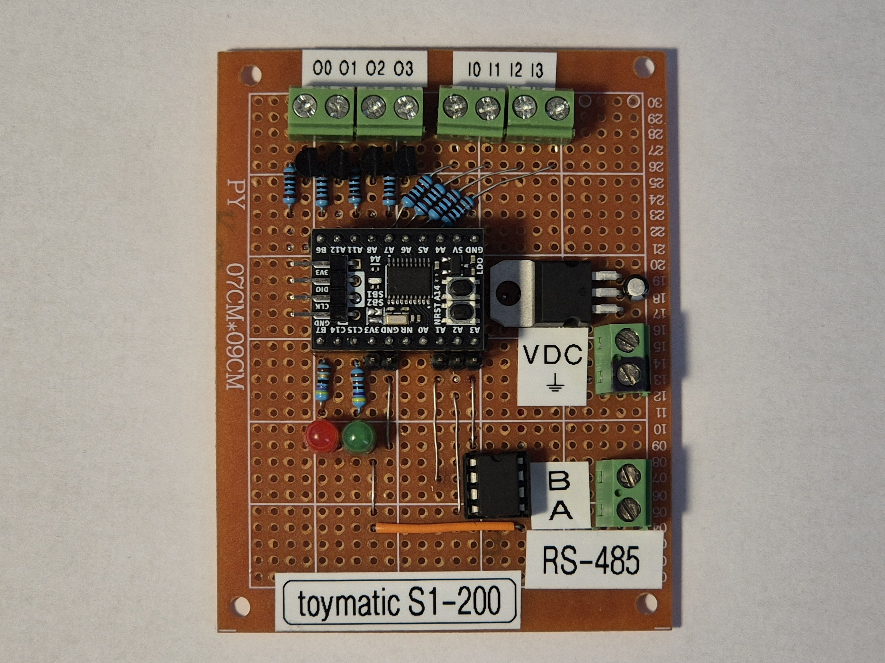
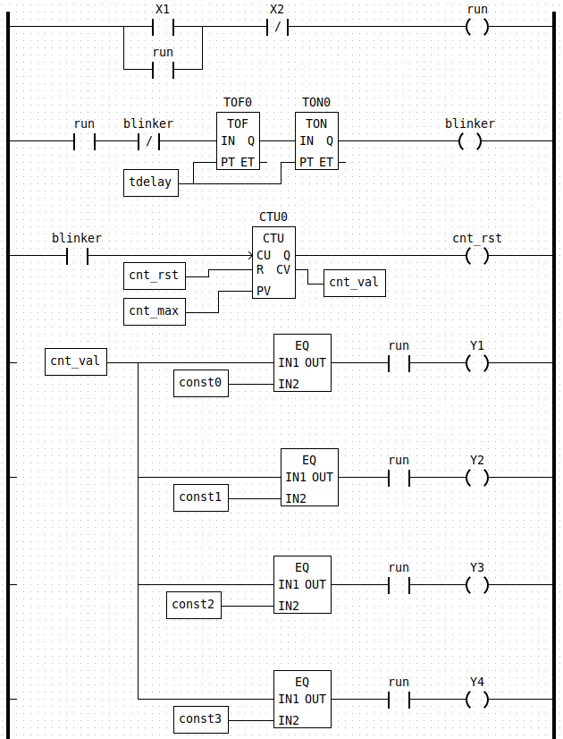
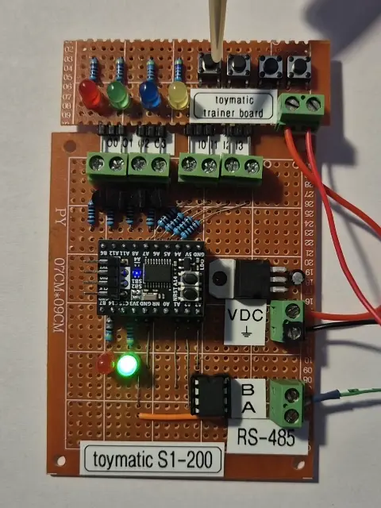

# toymatic

small PLC, usable with the Beremiz IEC 61131-3 IDE

## Summary

toymatic is an open-source PLC based around the STM32G031F6P6 microcontroller. It has 4 inputs, 4 outputs and an RS-485 port used for receiving PLC programs. The toymatic is programmed using the open-source [Beremiz](https://github.com/beremiz/beremiz) IEC 61131-3 IDE.

## Demo
The demo program included in the [Beremiz project template](beremiz_example/):

running on the PLC, with an I/O trainer board connected:

## Repository contents
This repository contains the [firmware](firmware/) for the PLC, the [host tool](host_tool/) used for programming the toymatic, the [runtime source code](runtime_src) in which PLC programs are executed and an [example project](beremiz_example/) for the Beremiz IDE which is also meant to be used as a template for other projects.

This repository makes extensive use of Makefiles. Running `make` in the root of the repository will build the toymatic firmware and host tool in their respective folders. Installing the host tool in `/usr/bin/` is done using `make install_tool`.

## Requirements
This project has been developed and tested on a host system running Ubuntu 24.04 LTS.

The integration of the example project with the Beremiz IDE expects this repository to reside in the home folder of the current user and for the Beremiz IDE to be installed at the same path as specified in the [Beremiz setup instructions](https://github.com/beremiz/beremiz?tab=readme-ov-file#build-on-linux-developer-setup).

At time of writing, the upstream Beremiz IDE has a few minor but breaking bugs which prevent the LD editor and Makefile integration to function. As such, I recommend using [my fork of Beremiz](https://github.com/tvlad1234/beremiz), which patches these issues.

Building the toymatic firmware requires the ARM GCC toolchain.

Building the PLC runtime requires `riscv64-unknown-elf-gcc`. The `newlib` headers are also required to be accessible at `/usr/include/newlib/`.

## Technical description

### Software
PLC programs are written in one of the programming languages defined by the IEC 61131-3 standard. The Beremiz IDE uses the `iec2c` compiler that's part of the [matiec](https://github.com/beremiz/matiec) project to compile IEC code into C source files. These C sources are then compiled into a 32bit RISC-V binary, along with the [runtime sources](runtime_src/). This binary is then uploaded to the toymatic PLC, where it is executed on a virtual machine powered by [cnlohr's mini-rv32ima](https://github.com/cnlohr/mini-rv32ima) emulator core.

The host tool communicates with the PLC over RS-485, using the Modbus RTU protocol and vendor-defined functions. The host tool must be invoked as follows: `toymatic_tool [serial port] [string of commands]`. The following commands are supported:
- `-f` fetches the current fault code from the PLC
- `-r` starts the PLC program
- `-s` stops the PLC program
- `-e` erases the program from the PLC
- `-c` clears the current fault code
- `-p [program file]` uploads a specified program file to the PLC

The firmware uses the [libopencm3](https://github.com/libopencm3/libopencm3) framework.

### Hardware

The toymatic uses an STM32G031F6P6 microcontroller. The four outputs are open collector, driven by NPN transistors. The four inputs are protected using 3.3V Zener diodes. A MAX485 transceiver is used for the RS-485 port.

Two LEDs provide status indication. The green LED is active while the PLC program is executing. A solid red light indicates that the program is stopped.
Flashing of the red LED indicates a fault
- 1 flash: bad program header or program checksum
- 2 flashes: RISC-V VM timeout
- 3 flashes: Cycle time exceeded

